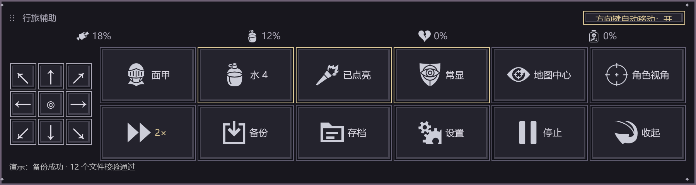
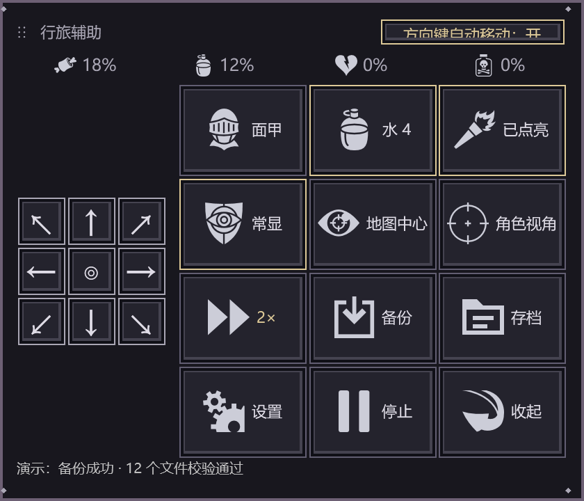
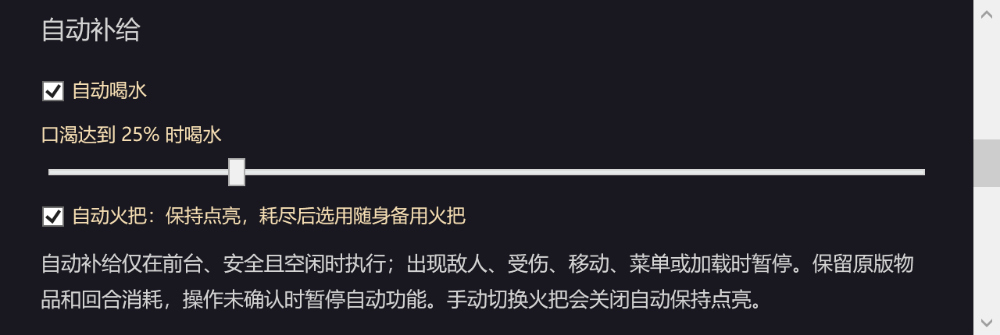
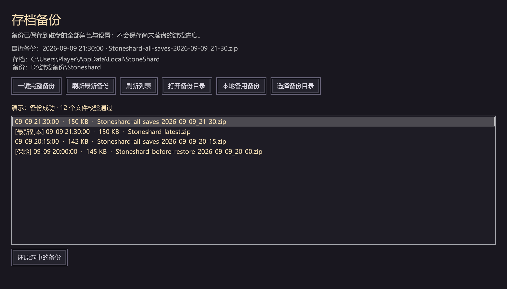

# Stoneshard Companion · 晶石助手

[](LICENSE)

**把走图、变速、补给和存档备份，放进一块可以自由摆放的游戏辅助面板。**

0.3.14 · Windows x64 · 非官方开源工具 · 适配 Steam 原版 **Stoneshard 0.9.4.25 / Build 24780451**

**[下载 Windows 免安装版 ZIP](https://github.com/tidus2005/stoneshard-companion/releases/download/v0.3.14/StoneshardCompanion-0.3.14-win-x64.zip)** · [全部版本](https://github.com/tidus2005/stoneshard-companion/releases) · [完整使用说明](docs/使用说明.md)



> 图片来自 **0.3.8 实际 WPF 界面组件的离屏预览**，角色数值、备份条目和路径为演示数据；不是游戏运行截图。自动功能在图中开启以展示效果，首次启动默认关闭。[图片生成方式](tools/DocImages/README.md)

**0.3.14 更新**：修复向上出口点击和饲料制作闪退，缩短切图等待；新增紧凑可调属性浮窗、补给续航、装备耐久预警、存档截图与总控设置。[发行说明与实测范围](docs/releases/v0.3.14.md)

An open-source Windows companion for Stoneshard with a movable overlay, speed controls, item labels, compass navigation, supplies, and save backups.

## 三步开始使用

1. 下载上面的 `StoneshardCompanion-0.3.14-win-x64.zip`，**完整解压**到普通文件夹。
2. 双击 `Start.cmd` 或 `StoneshardCompanion.exe`。随包包含 .NET，存档功能无需安装 PowerShell。
3. 打开适配版本的游戏，使用窗口或无边框全屏；把面板拖到技能栏旁的空余位置。

保留包内 EXE、DLL 和 Assets 文件夹；不要在 ZIP 内启动，也不要只复制 EXE。GitHub 自动提供的 `Source code` 是源码，不是可运行成品。

## 主面板：常用操作一眼找到

| 界面入口 | 能做什么 |
| --- | --- |
| 顶部四项状态 | 查看饥饿、口渴、疼痛、迷醉 |
| 左侧九宫格 | 八方向走图，中心键让角色走到地图中央 |
| 面甲 / 水 / 火把 | 一键开合面甲、喝水、切换火把 |
| 常显 | 开启地面物品名称常显，移动、装备栏切换和重连后保持 |
| 地图中心 / 角色视角 | 调整**镜头**位置；与九宫格的角色行走分开 |
| 速度图标 | 点击循环切换 1×、2×、3×，无需下拉菜单 |
| 备份 / 存档 | 立即备份，或打开历史列表与还原界面 |
| 设置 / 停止 / 收起 | 调整选项、停止辅助并恢复正常速度、收起面板 |

### 点击图标，直接切换速度

**正常 1× → 加速 2× → 急速 3× → 正常 1×**

每次点击切换一档，三个图标对应三种速度。切换地图、断线重连后继续使用所选倍率；打开物品栏、状态栏时也保持。暂停菜单、对话和大地图中暂回正常。希望下次启动继续沿用，可在设置中开启“下次启动游戏沿用倍率”。

### 九宫格走图，与方向键自动移动

| ↖ 左上角 | ↑ 上边缘并跨图 | ↗ 右上角 |
| :---: | :---: | :---: |
| **← 左边缘并跨图** | **◎ 走到地图中心** | **右边缘并跨图 →** |
| **↙ 左下角** | **↓ 下边缘并跨图** | **↘ 右下角** |

九宫格四个正方向会寻路到对应边缘中部，再点击出口进入相邻地图，本次行走随之结束；斜向键走到地图角点后停下。中心被占时，在周围最多 8 格范围内按距离选择最近的可达空位。中心键移动角色，面板右侧“地图中心”按钮只移动镜头。

开启右上角的 **“方向键自动移动”** 后，也可以这样走图：

1. 轻按键盘 ↑ / ↓ / ← / →，沿人物当前所在行或列走到对应边缘。
2. 到达边缘后自动前往实际出口格，并点击人物前进方向的外侧相邻格触发原版切图；每条路线只跨一张地图。
3. 行走途中再次按方向键可停步；长按不会连续触发。

自动行走沿用原版寻路与回合消耗。遇敌、受伤、手动接管、打开面板或切到后台时停止；不会自动攻击。不可达目标或出口会停止并提示。新增走图行为的验证范围见下方说明。

## 可拖拽、可缩放，给游戏界面留出空间



拖动顶部移动位置，拖动四个角改变宽高。上图是同一面板缩窄后的布局：九宫格仍在左侧，其余按钮自动换行，位置与尺寸会保存。

可以放在游戏下方的空余区域。打开游戏状态栏或物品栏时临时避让；回到主菜单、保存退出或游戏关闭后，仍保留存档备份入口。

## 喝水与火把：手动一键操作，也可开启自动补给



- **一键喝水**：点击主面板水图标，旁边显示可用次数；自动喝水可设置口渴阈值，图中为 25%。
- **一键火把**：点击火把图标手动切换；自动火把用于保持点亮，耗尽后选用随身备用火把。
- **自动功能默认关闭**：在设置中分别启用。只在游戏前台、安全且空闲时执行；移动、敌人、受伤、菜单或加载都会暂停。手动切换火把会关闭自动保持点亮。

补给保留原版物品和回合消耗，操作未确认时暂停自动功能。自动火把点亮与耗尽换备用仍待实机验证。

## 存档管理：备份、历史、还原都在一个窗口



| 想做的事 | 点击哪里 |
| --- | --- |
| 留一份当前存档 | **一键完整备份**，保存已落盘的全部角色与设置 |
| 更新一个固定的最新副本 | **刷新最新备份**，同时新增历史备份，旧历史保留 |
| 找到以前的进度 | **刷新列表**，选择对应时间的备份 |
| 恢复所选进度 | **还原选中的备份**，阅读确认提示；还原前自动创建保险备份 |
| 改用 Windows 本地磁盘等目录 | **选择备份目录**，记住新位置，旧目录中的备份保留 |
| 查找传输失败后保留的副本 | **本地备用备份**，打开已校验 ZIP 的保留目录 |

**推荐顺序：游戏内保存 → 回到主菜单或退出游戏 → 点击备份。** 助手只备份已经保存到磁盘的进度，不会强制游戏保存。还原前同样应回到主菜单、死亡界面或退出游戏，再按提示确认。

0.3.8 先在 Windows 本地生成并校验 ZIP，再传输到备份目录，减少共享盘的小文件读写；传输失败时保留已经生成的本地 ZIP 与校验文件，未完成的上传不进入历史列表。目标目录一开始就无法访问时尚未生成本地副本，界面会据实报错。列表在后台读取，存档操作不再依赖 PowerShell 模块。

Mac 虚拟机中的“文档”可能位于共享目录，遇到断开或不可写可改选 Windows 本地目录。**本版已在 Mac 的 Windows ARM64 虚拟机实测共享目录备份**；具体备份保护与限制见 [0.3.8 共享目录备份加固](docs/0.3.8共享目录备份加固.md)。

## 适配与验证范围

发行包面向 **Windows 11 x64（Intel / AMD）**，不是 Windows ARM64 原生包，也不是 macOS 应用。游戏桥接锁定 Steam 原版 **0.9.4.25 / Build 24780451** 的 EXE 与 data.win 哈希，版本不符会拒绝连接。

实际验证了四方向切图、整行寻路、蓝莓制作饲料、喝水与进食后属性变化、续航采样、黄色耐久提醒、外观配置、属性关注、存档截图及完整退出。损坏红色与异常路径使用模拟回归；其他硬件、DPI、所有食物和战斗场景尚未逐项覆盖。完整范围见 [0.3.14 发行说明](docs/releases/v0.3.14.md)。

**升级至 0.3.14 请正常退出游戏，以加载 v11 桥接。** 自动更新会等待游戏关闭后安装并重启助手。工具包不含游戏、个人存档或本机设置。

<details>
<summary>使用说明、设计与历次验证报告</summary>

- [使用说明](docs/使用说明.md)
- [0.3.9 走图与重定向目录修复](docs/0.3.9走图与重定向目录修复.md)
- [0.3.8 共享目录备份加固](docs/0.3.8共享目录备份加固.md)
- [0.3.7 存档兼容性修复](docs/0.3.7存档兼容性修复.md)
- [0.3.6 改动与离线验证](docs/0.3.6改动与离线验证.md)
- [0.3.5 便携发行与验证](docs/0.3.5便携发行与验证.md)
- [0.3.4 实现与离线验证](docs/0.3.4实现与离线验证.md)
- [0.3.3 实现与离线验证](docs/0.3.3实现与离线验证.md)
- [0.3.2 修复与实机验证](docs/0.3.2修复与实机验证.md)
- [0.3.1 实机稳定性测试](docs/0.3.1实机稳定性测试.md)
- [0.3 实现与离线验证](docs/0.3实现与离线验证.md)
- [0.2 历史实现与实测](docs/0.2实现与验证.md)
- [详细设计](docs/详细设计.md)

</details>

## 开发

需要 [.NET 8 SDK](https://dotnet.microsoft.com/download/dotnet/8.0)、
[Zig 0.13.0](https://ziglang.org/download/0.13.0/) 和
[PowerShell 7](https://github.com/PowerShell/PowerShell/releases)。
Zig 解压为 `.tools/zig-windows-x86_64-0.13.0/`，或将 `zig.exe` 所在目录加入 PATH。
离线构建、测试不需要安装游戏。

```powershell
git clone https://github.com/tidus2005/stoneshard-companion.git
cd stoneshard-companion
pwsh -File scripts/test-offline.ps1
pwsh -File scripts/build.ps1 -Publish
pwsh -File scripts/test-portable.ps1 -ZipPath artifacts/release/StoneshardCompanion-0.3.9-win-x64.zip
```

离线检查不访问游戏内存、不发送输入、不打开窗口，存档检查只写独立临时目录。发布生成版本目录、完整文件 SHA256 清单及 ZIP。

维护者也可在 GitHub Actions 手动运行 **Build Windows portable release**：Windows 构建机先完成离线和便携检查，再上传 ZIP 与校验文件并发布。版本读取项目文件，说明读取 `docs/releases/v<版本>.md`；已公开的版本不会覆盖。

`src/Overlay` 为 WPF 界面；`src/Core` 管理连接、策略、布局和存档服务；`native/Bridge` 为游戏主线程适配层；`native/Tests` 模拟原生调用；`src/Probe` 包含诊断和离线检查；`tests` 包含原存档核心回归。**Probe 除 SelfTest/OfflineTest 外的命令会接触游戏，不属于离线检查。**

桥接以完整 EXE 和 data.win 哈希锁定适配版本，版本不符时拒绝连接。
共享目录验证见 [测试脚本](scripts/test-shared-save.ps1)，首页图片可用 [文档预览工具](tools/DocImages/README.md) 从实际界面组件重新生成。
研究脚本使用说明见 [research/README.md](research/README.md)，原始诊断和游戏副本不纳入公开仓库。

## 开源许可与贡献

原创源码和文档采用 [MIT 许可证](LICENSE)。Game-icons.net 图标保持
[CC BY 3.0 署名](src/Overlay/Assets/Icons/ATTRIBUTION.md)，完整说明见
[第三方声明](THIRD_PARTY_NOTICES.md)。本项目与 Stoneshard 开发商、发行商无隶属关系。

公开仓库不包含游戏程序、素材、个人存档、测试安装副本或本机环境快照。
欢迎提交 Issue 和 Pull Request，参与方式见 [CONTRIBUTING.md](CONTRIBUTING.md)。
