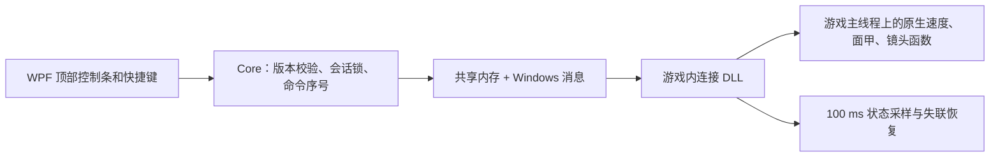

# 晶石助手 0.1.0：实现与验证

日期：2026-09-05。适配本机原版 Stoneshard 0.9.4.25，Steam Build 24780451，Windows x64。

## 已实现

| 用户功能 | 实现 |
|---|---|
| 屏幕上方控制条 | .NET 8 WPF，无边框、置顶、不激活窗口；跟随游戏显示器；支持折叠 |
| 1～4 倍速度 | 通过游戏原生 `game_get_speed` / `game_set_speed` 调整引擎步进目标 |
| 面甲快捷操作 | 找到装备槽中的头盔，调用原生 `o_visor_toggle` 用户事件，读取 `isOpen` 确认成功 |
| 地图中心 | 用当前 room 尺寸计算中心，临时设置 `oCamera.freeCamera`，经原生镜头更新脚本生效 |
| 返回角色 | 恢复镜头跟随，并回到角色绘制坐标；角色开始移动也会自动恢复 |
| 进图自动居中 | 观察镜头实例变化，等待 600 ms 稳定后，在游戏前台居中；本次连接有效 |
| 恢复与隔离 | 后台恢复、关闭恢复、心跳失联恢复；正式 EXE / data.win 哈希门控；单控制器文件锁 |

原有研究阶段设想的 modbranch 路线未用于当前成品。本机正式版为 GameMaker YYC 原生编译，已通过注册表和局部静态分析确定当前版本的调用入口，随后在独立测试副本中验证。没有修改正式游戏的数据包。

## 结构与生命周期



连接前校验 PID、启动时间、路径，以及完整 EXE 和 data.win 的 SHA256。DLL 的启动入口放在 `DllMain` 之外；游戏操作在窗口消息所属主线程执行，不在外部工作线程直接执行 GML。

共享内存为 4096 字节，协议定义在 `native/Bridge/protocol.h`。每条命令有序号与 1500 ms 截止时间；同一序号最多执行一次。状态使用序列锁，宿主每 200 ms 发送心跳。失联或工具退出后，恢复基准速度与辅助镜头状态。若游戏主线程暂停处理消息，恢复会延迟到消息循环恢复。

DLL 在游戏进程中保持加载直至游戏退出，避免卸载仍可能被调用的窗口回调。重新安装或升级工具后应重启游戏。成品仅包含本项目程序和 .NET 运行时，不分发任何游戏资源。

## 测试隔离

- 游戏复制到 `%LOCALAPPDATA%\StoneshardCompanion\TestGame`。
- 仅在副本的 data.win 中把两个项目名称字符串改为 `ShardTest0`，原 EXE 不变。
- 实际启动确认存档目录为 `%LOCALAPPDATA%\ShardTest0`，随后复制角色文件到该目录测试。
- 原角色文件建立 SHA256 清单；测试中检查 40 个文件，变化数为 0。
- 正式安装 EXE 与 data.win 哈希仍与开发前一致。

这是隔离副本上的真实运行验证；没有让正式存档承受测试操作。

## 自动回归

最终连接组件通过 14 项断言。结果保存在 本机 `docs/verification-results.json`（原始诊断未公开）。

| 档位 | 目标步进/秒 | 实测步进/秒 | 相对正常速度 |
|---|---:|---:|---:|
| 1× | 40 | 40.18 | 1.00× |
| 2× | 80 | 79.52 | 1.99× |
| 3× | 120 | 118.64 | 2.97× |
| 4× | 160 | 159.96 | 4.00× |

测量方法：读取持续运行的镜头控制器步进计数，按外部真实时间计算约 2 秒内增量。它验证引擎步进速度，不能当作所有地图、所有硬件上行走耗时的精确倍数保证。

其他通过项：第二个控制器被拒绝；非法 5 倍命令不改变现有速度；镜头居中后保持且不移动角色；返回角色；面甲关闭→打开→关闭；控制器断开后速度与镜头自动恢复。

## 桌面实测

- 自带运行时的发布 EXE 启动成功，顶部控制条、设置窗口和中文按钮可见，布局完整。
- 点击三倍速按钮后，游戏前台状态为真、目标步进为 120；打开工具设置后，游戏进入后台且目标恢复 40。
- 速度快捷键实测生效。
- 无边框全屏实测：游戏前台，窗口覆盖 2560×1440 逻辑桌面；截图可见控制条位于顶部。系统窗口顺序检查也确认控制条位于游戏上方且具有 Topmost 标志。
- 真实画面和游戏日志确认面甲打开，保留原生回合消耗。
- 自动居中开启后重新载入地图：地图 2340×2340、视口 640×360、镜头左上角 `(850, 990)`，中心正好为 `(1170, 1170)`；角色仍在 `(1105, 1053)`。
- 点击地面移动后，角色 Y 变为 1079，辅助镜头模式从 1 恢复为 0。

## 实际边界

仅适配该版本及其原始数据包。窗口和无边框全屏均已验证；没有对所有头盔、所有地图、超宽屏、多显示器切换、独占全屏或长时间运行做全覆盖验证。进图检测目前以镜头实例变化为依据，对未重建镜头实例的特殊场景需要后续增加适配。

地图中心功能保留战争迷雾和当前缩放。速度是全引擎加快，不改变每回合移动格数；面甲动作保留游戏本身的可用条件和回合消耗。

## 复现

```powershell
.\scripts\build.ps1 -Publish
# 只在独立测试游戏中运行；Verify 会切换速度、镜头与面甲。
dotnet src\Probe\bin\Release\net8.0-windows\StoneshardCompanion.Probe.dll <测试PID> Verify 0 artifacts\native\StoneshardBridge.dll
```

`research/prepare_sandbox.py` 默认拒绝覆盖已有测试目录。静态分析产生的反汇编仅保留在忽略的 `artifacts` 中，不作为成品文件发布。
