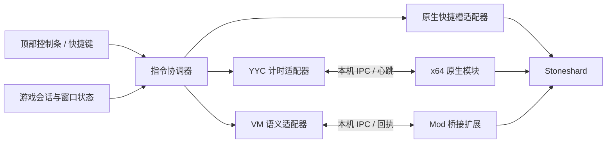

# 紫色晶石辅助工具详细设计

版本：设计稿 1.0 · 2026-09-05 · 对象：Windows 上的 Stoneshard 0.9.4.25。

**建议采用“顶部置顶控制条 + 游戏适配层”。** 先针对当前正式版验证变速及原生面甲快捷栏；地图中心功能需要确认当前镜头控制逻辑。若正式版无法稳定实现完整功能，再采用经过版本核验的 `modbranch` 和最小功能 Mod。界面可以统一，底层实现按实际能力选择。

本次完成只读技术研究和可供开发的设计，没有制作或运行可用辅助程序。下文分别标注本机证据、公开实现和待验证事项，不把找到函数名当成功能已经实现。

## 1. 产品范围与行为

| 功能 | 用户操作 | 预期结果 |
|---|---|---|
| 游戏上方控制条 | 启动工具；进入游戏 | 游戏所在屏幕顶部显示小条，默认固定位置，可收起；点击不抢走游戏键盘焦点 |
| 四档变速 | 点击 1× / 2× / 3× / 4×，或快捷键 | 缩短走路及游戏执行的现实等待，按游戏原逻辑加快整体运行；1× 恢复正常 |
| 头盔面甲快捷键 | 单键开合，面板也有按钮 | 执行游戏原有“打开/关闭面甲”动作，免去每次打开 B 菜单寻找动作 |
| 当前地图居中 | 按快捷键/点击按钮；可启用“进入新地图自动居中” | 镜头中心移到当前局部地图的几何中心，角色位置不变 |

“头盔开关”在本稿中解释为可开合头盔的**面甲**，不指穿戴/卸下装备。“整张地图”解释为人物当前所在的局部区域，不是世界大地图。镜头居中保持当前缩放；一次显示整张地图是另一个缩放需求。

Stoneshard 是回合制游戏。变速的默认契约是相同行走格数、相同行动仍执行相同游戏规则，现实完成时间缩短；不额外生成行动、不修改每回合可走格数。世界时间、饥渴、状态持续时间是否保持这个契约，必须在当前版本验证。玩家站立不操作时，不因工具额外推进回合。[游戏官方介绍](https://store.steampowered.com/app/625960/Stoneshard/)

## 2. 本机研究结果

观察时间：2026-09-05 21:39–21:42（北京时间）。原始证据见 本机程序包报告与环境报告（含本机信息，未公开）。

| 项目 | 本次实际发现 | 对设计的影响 |
|---|---|---|
| 安装位置 | 本机 Steam 库中的 Stoneshard 目录 | 从 Steam 库定位游戏，不让用户每次填路径 |
| 当前进程 | `StoneShard.exe`，当时 PID 109508，窗口标题 Stoneshard，响应正常 | PID 是瞬时值，程序应每次识别，不写死 |
| 游戏版本 | EXE FileVersion / ProductVersion 均为 `0.9.4.25` | 所有适配先以这个实际版本验收 |
| Steam | AppID `625960`，Build `24780451`；manifest 未出现 BetaKey | 与当前原生编译包结合，按正式版路线研究；不能只靠缺少 BetaKey 判定所有分支信息 |
| 架构 | PE Machine `0x8664`，64 位 | 原生扩展/注入组件需 x64 |
| 包结构 | `data.win` 109,736,736 字节，完整 FORM，共 28 个块；没有 CODE 块 | 不能把它视为包含可直接修改 GML 字节码的 VM 包 |
| 编译线索 | options.ini 有 LLVM-WINDOWS；EXE 166,577,664 字节，包含 GML 原生函数标识 | 综合证据支持 YYC 原生编译形式 |
| 计时与渲染导入 | QPC/QPF、GetTickCount64、timeGetTime、Sleep、D3D11CreateDevice、CreateDXGIFactory1 | 有计时与 D3D11 入口，具体使用方式及 hook 效果未验证 |
| 显示设置 | video.displayMode=`fullscreenBorderless`；渲染分辨率 2560×1440；display 记录 3840×2160 | 符合外部置顶条候选环境；必须处理 DPI 与渲染/屏幕坐标差异 |
| 配置冲突 | video 与 main 中 fullscreen/vsync 值不一致；main.return camera=1 | 存在旧字段，不能把磁盘配置当运行中真实模式 |
| 面甲标识 | `scr_item_helm_toggle_visor`、`o_visor_toggle`、`s_visor_on/off` | 原生逻辑接入候选；字符串不是导出接口，参数和地址未知 |
| 镜头标识 | `scr_cameraUpdate`、`scr_cameraViewUpdate`、`scr_cameraAttachToRoom`、`o_cameraController`、`cameraMain` 等 | 新旧镜头命名并存，应跟踪实际主镜头及控制器 |

额外发现 `gml_Object_o_cameraController_KeyPress_35`，提示控制器有对应键事件。**没有证据证明它就是“End 键移到地图中心”**，不把这个猜测作为实现。

安装文件 SHA256：

```text
StoneShard.exe  d45797505f04b9112c5fbb8e85c0f8cda2fa60aee954b4e108bad8a0dc514afa
data.win       84034525fcdef3c6fd9803628b8de6c43fea479c930e168a95906de37a2ae19c
```

这些是本次本机快照，不是“官方原版认证”。本次未读取角色存档内容；没有做进程内存分析、函数反编译或游戏交互测试。[GameMaker 关于 YYC 与 VM 的区别](https://manual.gamemaker.io/monthly/en/Settings/YoYo_Compiler.htm)

## 3. 最重要的现成能力：面甲支持快捷栏

游戏官方 **0.9.4.21** 公告描述了一个修复：面甲动作图标放在快捷栏后，经右键菜单执行不应重复触发。这确认了游戏已有面甲动作上快捷栏的能力。本机 0.9.4.25 较新，因此应先验证这条原生路径。[官方 0.9.4.21 公告](https://steamcommunity.com/games/625960/announcements/detail/699891910775407295)；公告正文也收录于[官方新闻汇总](https://steamcommunity.com/app/625960/allnews/?l=english)。

最小验证：在有可开合头盔的测试角色上，查看 B 菜单/动作入口，把开合动作配置进空闲快捷槽，再按该槽键。记录它是一个切换图标还是两个动作、快捷栏翻页影响、是否耗回合、没有面甲时的表现。本次没有在你的角色上实际操作，不指定未经验证的拖拽步骤。B 可能对应动作/模式菜单，不能直接称为背包键。

工具只需让用户绑定一个自定义按键，映射到该快捷槽；若原生槽键已经顺手，也可直接使用。这样保留游戏自身的装备条件、属性更新、动画与回合处理。不要同时发送“打开”和“关闭”两个动作碰运气，也不要复制旧版 Mod 里的装备属性表。

## 4. 技术路线与选择条件

| 路线 | 置顶 | 变速 | 面甲 | 地图中心 | 结论 |
|---|---|---|---|---|---|
| 纯外部按键/鼠标宏 | 可实现 | 不能仅靠宏实现引擎变速 | 优先映射原生快捷槽；鼠标宏备用 | 不能可靠得知地图真实边界 | 只能覆盖部分需求 |
| 当前 YYC + 进程计时模块 | 可实现 | 通用实现有先例，本版待测 | 原生槽映射 | 仍需原生镜头适配或已验证的内置动作 | **当前安装的首个验证路线** |
| 匹配版本的 VM/modbranch + 最小 Mod | 可实现 | GameMaker API 有源码先例 | 可调用原生面甲动作并读取状态 | 可接入地图与镜头逻辑，待本版适配 | **完整语义功能的优先候选** |
| 当前 YYC 深度原生适配 | 可实现 | 可研究引擎入口或计时缩放 | 可研究原生调用 | 可研究控制器/变量 | 工程和维护成本最高，前两路不足时再做 |

原版 ModShardLauncher 作者安装指南要求 `modbranch`。较新的 Enhanced 作者页面声称可加载 YYC 的 data.win，但“能加载资源”不能证明“能修改本版原生速度、面甲与镜头逻辑”。需按能力验证，不能以启动器名字推断兼容。[MSL 安装指南](https://modshardteam.github.io/ModShardLauncher/guides/how-to-play-mod.html)、[Enhanced 作者说明](https://www.nexusmods.com/stoneshard/mods/103?tab=description)

决策顺序：

1. 保持当前安装，验证原生面甲快捷槽和置顶交互。
2. 用隔离测试角色验证 YYC 计时模块；通过后提供四档速度。
3. 调查本版局部地图边界与镜头控制器；若有原生动作满足要求，直接复用。
4. 若镜头功能需脚本接入，先确认可取得对应版本的 VM 包、Mod API 和存档兼容，再决定完整版本使用 VM 还是维护 YYC 适配。
5. 任一必需功能尚未通过，不把部分功能工具标为“三项全部完成”。

本轮不切换 Steam 分支、不安装 Mod。后续切换属于具体开发方案的选择，不是打开工具时自动执行的动作。

## 5. 界面与交互设计

主条约 **660×56 DIP**，深灰背景、紫色选中态、高对比度中文文字。默认固定在游戏所在屏幕顶部中央，留出约 10 DIP 边距；提供解锁拖动，保存显示器与相对位置。空间不足时切换紧凑布局，不裁掉停止按钮。

```text
┌──────────────────────────────────────────────────────────────────────┐
│ ◆ 晶石助手  [1×][2×][3×][4×] │ 面甲 ⇄ │ 地图中心 │ 恢复正常 │ − │ ⚙ │
│ 游戏已识别 · 目标 2× 已应用     面甲：未读取             自动居中 □   │
└──────────────────────────────────────────────────────────────────────┘
```

上图是拟定布局，不是运行截图。面甲符号在正式实现中须带可读文字/提示；所有按钮提供可见的键位提示和状态说明。

| 状态 | 文案与行为 |
|---|---|
| 未发现游戏 | “等待 Stoneshard 启动”；游戏操作不可点 |
| 已识别，尚无适配 | 显示版本；每个功能分别说明能力，不把“发现进程”显示成“已连接全部功能” |
| 支持且已连接 | 操作可用，倍速等待回执后更新；目标倍率与实测倍率分开 |
| 游戏失焦 | “游戏在后台”；取消待执行输入；默认请求恢复 1×，保留用户选择但回到游戏后不自动重新加速 |
| 当前场景不允许 | 如“加载中，稍后操作”；拒绝面甲与镜头操作 |
| 快捷槽模式 | 显示“面甲：未读取”，执行后为“按键已发送”，不虚构实际开关状态 |
| 不支持当前版本 | 对应功能禁用，保留置顶/设置及支持的能力 |
| 断开或恢复失败 | 显示“连接已断开 / 正常速度未确认”，不显示绿色成功 |

默认快捷键草案：Ctrl+Alt+1/2/3/4 设置倍率，Ctrl+Alt+H 开合面甲，Ctrl+Alt+C 地图中心，Ctrl+Alt+R 返回角色，Ctrl+Alt+S 恢复正常，Ctrl+Alt+O 显示/收起。均可改成用户习惯的单键；首次注册检查游戏、系统与其他工具冲突，不占用 F12。普通游戏热键仅在游戏前台注册，紧急恢复可全局保留。

“恢复正常”统一执行：请求 1×、取消动作队列、关闭自动居中、解除工具的镜头接管并交还原控制器；不更改头盔穿戴或面甲当前状态。收起条仍保持功能，关闭工具则触发恢复流程。

设置窗口独立打开，负责键位、速度偏好、自动居中、兼容性和退出；游戏控制条不包含需要键盘焦点的文本输入。

## 6. Windows 置顶实现

建议 **C# WPF + Win32**，发布 Windows x64 自包含桌面包。新工程使用开发时仍受支持的 .NET LTS，锁定 SDK 和依赖版本；本机目前有 8.0.421 SDK，不能据此把其长期维护周期视为设计保证。

- 无边框小窗；`WS_EX_TOOLWINDOW`、`WS_EX_NOACTIVATE`；WPF `ShowActivated=false`。
- `SetWindowPos(HWND_TOPMOST, ..., SWP_NOACTIVATE)`；`WM_MOUSEACTIVATE` 返回 `MA_NOACTIVATE`。按钮点击不激活控制条。
- 只创建小条的交互区域；避免全屏透明窗吞掉地图点击。收起时隐藏交互窗，可保留单独的整窗穿透状态提示。
- 监听前台、窗口位置、最小化和显示器变化，不循环抢焦点。普通窗口与无边框全屏是首版保证场景。
- 声明 Per-Monitor V2；布局用 DIP，窗口定位/鼠标输入统一转换为物理像素，支持混合 DPI 和次屏负坐标。

真正的独占全屏无法仅凭 Topmost 保证覆盖，需要另做游戏内绘制或渲染接入。本机配置写着无边框全屏，仍需真实进入游戏验证。点击条上的按钮既不能让游戏失焦，也不能同时触发其下方的角色移动。[SetWindowPos](https://learn.microsoft.com/en-us/windows/win32/api/winuser/nf-winuser-setwindowpos)、[WM_MOUSEACTIVATE](https://learn.microsoft.com/en-us/windows/win32/inputdev/wm-mouseactivate)、[Microsoft 全屏优化说明](https://devblogs.microsoft.com/directx/demystifying-full-screen-optimizations/)

详细的穿透、DPI 与 SendInput 限制见 [Windows 专项研究](research-overlay.md)。不能把 `HTTRANSPARENT` 单独当作跨进程穿透方案。

## 7. 四档变速实现

### 7.1 当前 YYC：验证进程时间缩放

独立 x64 原生模块只接入已匹配的游戏会话。候选入口包括本机确实导入的 QPC、GetTickCount64、timeGetTime；实际需要拦截哪些时间源，应先跟踪游戏使用方式。导入表不能证明拦截一个函数就能得到准确四倍速。

保持虚拟时间连续的数学模型：`虚拟时间 = 虚拟基点 + (真实时间 - 真实基点) × 倍率`。切换倍率时先用旧倍率计算当前虚拟值，再一起更新两个基点与倍率；多线程读写原子化，处理递归调用、整数精度和计数回绕。QPC 频率与所有时间单位必须自洽，不修改 Windows 系统时间。

这是已有作者实现支持的通用原理，不是本版已经可用的成果。还可能遇到 VSync、真实等待函数、渲染瓶颈及音频/菜单同进程计时影响；不承诺目标倍率等于实测倍率。[公开变速实现](https://github.com/cheat-engine/cheat-engine/blob/master/Cheat%20Engine/speedhack/speedhackmain.pas)

### 7.2 VM：修改游戏目标执行速度

在已核验的 VM 游戏中，用最小控制器保存原始基准，调用 `game_set_speed(base × multiplier, gamespeed_fps)`。公开 Stoneshard 速度 Mod 以 40 为基准，四档对应 40/80/120/160；本工具必须读取并验证当前基准，不能把旧源码的 40 写死为所有版本事实。[Speedshard 作者源码](https://github.com/remyCases/SpeedshardCore/blob/cc76a0684d2cabfb0467ab2e8c6827bae40a546f/Speedshard_Core.cs)、[GameMaker API](https://manual.gamemaker.io/monthly/en/GameMaker_Language/GML_Reference/General_Game_Control/game_set_speed.htm)

只实现独立速度功能，不整包引入经验、声望、饮水或回合移动格数调整。初始化、读档、玩家重建、换图均保持同一倍率基准。检测已有速度控制器，避免两套 Alarm/Step 逻辑互相覆盖。

### 7.3 两种后端共同要求

- 倍率只允许 1/2/3/4；`SetSpeed(2)` 可重复执行，不能每次把当前速度再乘 2。
- UI 分开记录用户选择、后端确认、真实路径计时结果；`game_get_speed` 本身返回目标值。
- 首次启动默认 1×；默认后台恢复 1×；进入战斗自动恢复只在能可靠读到战斗状态的适配器中开放。
- 独立真实时钟心跳：设计值每 250 ms 一次，超过 1.5 s 失联请求恢复正常；后端用未缩放时钟判断，不能依赖被加速的游戏 Alarm。
- 正常退出和 UI 崩溃都必须能恢复；若游戏主线程挂起，只能在恢复执行后应用引擎级恢复，不承诺对挂死进程即时生效。
- “恢复 1×”与“卸载原生模块”分开。无安全卸载证据时采用透传状态，随游戏退出释放。

## 8. 面甲快捷键实现

优先级依次为原生快捷槽映射、语义适配器、可校准 UI 自动化。

**原生快捷槽模式**：设置中记录用户选定槽及对应键；自定义热键释放修饰键后，校验游戏仍在前台，发送一次槽键。能识别当前页与槽图标时，确认匹配后才执行；快捷栏换页/槽绑定变化导致能力不再可靠时禁用，要求重新配置。若无法读取页面和绑定，只能作为用户手动启用的普通键映射，明确“仅发送已配置的槽键，无法判断其是否仍为面甲”，不能承诺自动避免其他技能；更改工具绑定后必须重新启用。要达到自动判断和稳定一键面甲的完整验收，必须增加可靠识别或语义适配。不要发送 B 作为每次必需步骤。

**语义模式**：找出当前装备头盔与可执行面甲动作，复用 `scr_item_helm_toggle_visor` 对应原生路径，等待动作完成后读回面甲状态。不能仅改变 `visor` 布尔量，否则可能漏掉视野、抗性、图标或状态刷新。函数名来自静态字符串，调用签名、调用线程与前置条件仍待验证。

能读取状态时，协议提供 `SetVisor(open|closed, expectedState)`，与界面的一键切换结合；不能读时只提供 `ToggleVisor`。每个 commandId 至多执行一次，Toggle 超时禁止自动重试。背包/商店/对话/过场中是否能执行由原生动作条件决定。

**UI 自动化备用模式**：识别菜单已开或未开、实际面甲目标和结果；校准绑定窗口尺寸/DPI/UI 缩放。用户移动鼠标、切换窗口或识别失败立即取消。固定延迟和屏幕绝对坐标不能作为成功依据。仅在本工具打开菜单时考虑恢复菜单状态。

`SendInput` 是系统输入流，并非定向后台 API，受 UIPI 和当前修饰键影响。与游戏同权限运行，逐步检查前台；不通过管理员权限掩盖错误的输入策略。[Microsoft SendInput](https://learn.microsoft.com/en-us/windows/win32/api/winuser/nf-winuser-sendinput)

## 9. 当前局部地图中心实现

这项需要拿到**实际区域边界和主镜头视口**。屏幕中心、人物坐标、地图图片尺寸或 UI 拖动距离都不足以计算可靠的地图中心。

设可玩区域边界为 `L,T,R,B`，主镜头可见世界尺寸为 `Vw,Vh`：

```text
Cx = (L + R) / 2
Cy = (T + B) / 2
X  = Cx - Vw / 2
Y  = Cy - Vh / 2
```

区域大于视口时，将 X/Y 限制在游戏允许的镜头边界；区域小于视口时，优先沿用引擎的留边/居中策略，不能向 `clamp` 传入颠倒的上下界。地图存在填充边、过渡带或多个逻辑区域时，先验证“当前地图”的真实网格边界；不能直接假定 `room_width/2` 就是玩家认为的地图中心。

VM 适配器可研究 `camera_set_view_pos`，但必须使用真正的主游戏摄像机及其世界尺寸，不能把 GUI 摄像机或屏幕像素拿来计算。当前包中 `oCamera` 与 `o_cameraController` 等并存，需要确认哪一个在每帧覆盖位置。[GameMaker 镜头位置 API](https://manual.gamemaker.io/monthly/en/GameMaker_Language/GML_Reference/Cameras_And_Display/Cameras_And_Viewports/camera_set_view_pos.htm)

镜头状态设计：

```text
跟随角色 → 请求居中 → 等待场景稳定 → 地图中心浏览
                                     ↓
                       玩家移动 / 手动拖镜头 / 返回角色
                                     ↓
                              交还原生镜头控制
```

“地图中心浏览”需暂停会立即拉回角色的跟随行为，按原生控制器适合的时机设置目标，不能每帧与它争写摄像机。默认在玩家移动或主动拖动时退出；可在设置中扩展为持续锁定，但不作为首版默认。剧情镜头具有优先权，结束后重新检查状态，不抢剧情控制。

“返回角色”和“解除接管”分开实现：前者显式调用原生角色居中逻辑，并检查镜头已对准当前角色；不能仅清掉接管标志，因为用户可能原本关闭了跟随。后者恢复接管前的模式，只有场景代次仍一致时才允许恢复旧目标；换图后使用新场景的原生默认状态，绝不恢复上一地图的对象引用。返回角色的一次居中不永久改写用户原有跟随偏好。

“进入地图自动居中”默认关闭，用户可开启。监听有效场景代号变化，待地图边界、玩家和主镜头已准备好后执行一次。代号至少包含会话与场景加载代次；随机地图可能复用同一个 GameMaker room，不能只比较 room ID。新的换图、读档或过场使旧居中请求失效；2 s 后仍未就绪则取消并提示，不用固定睡眠盲写。

验收时必须看到角色坐标、物品、回合与探索状态没有被这项功能改变。镜头移动不额外揭开战争迷雾或显示未探索数据；镜头能否达到未探索区域遵循最终选定的产品范围与游戏限制。

## 10. 程序结构与通信



T 与 M 是可选速度后端，**同一会话只启用一个速度控制方**。H 可作为面甲能力补充。未来若维护 YYC 镜头适配，独立加入，不能假定计时模块天然拥有地图数据。

推荐目录：

```text
src/Overlay/              WPF 控制条与设置
src/Core/                 会话、能力、命令、状态机
src/Windows/              热键、窗口、DPI、输入
src/Adapters/             快捷槽、YYC、VM 能力适配
native/ClockBridge/       x64 计时与恢复，仅实际采用时开发
mod/Companion/            最小 GML 补丁，仅实际采用时开发
compatibility/            按版本/指纹记录能力与验证结果
tests/                    协议、时钟、状态机及集成验证
```

语义接口是**拟开发协议，不是游戏已有公开 API**：

| 指令 | 参数 | 回执 |
|---|---|---|
| GetCapabilities | 会话信息 | 每项能力、状态是否可读、适配版本 |
| SetSpeed | 1/2/3/4 | 已应用目标，或拒绝原因 |
| ToggleVisor / SetVisor | 操作、预期装备/面甲状态 | 已执行并读回 / 仅按键已发送 / 拒绝 |
| CenterLocalMap | 预期场景代号 | 镜头中心、模式、实际场景代号 |
| ReturnToPlayer | 当前会话、预期场景代号 | 已对准当前角色并交还控制 / 未确认 |
| Reset | 当前会话 | 倍速恢复与镜头释放分别确认 |

每条消息包含 protocolVersion、sessionId（PID+启动时间+随机代号）、commandId、expectedSceneToken 和期限；上限 16 KB，单次动作串行，重复命令去重。只保留最新的倍速设置；面甲忙时拒绝重复点击；切图取消旧的面甲/镜头操作。回执区分 received、applied、rejected、expired，收到消息不等于已经执行。

优先使用限当前 Windows 用户访问的本机命名管道，游戏侧通过小型原生扩展桥接。GML 不天然具备 .NET 管道 API，需要核实当前 Mod 扩展注册机制。I/O 线程只收发数据，游戏动作排入主线程合适的事件执行；管道断开时触发恢复。简单命令文件可作开发阶段备用，但要有原子替换、序号和过期处理，不用高频写存档目录。

能力标志至少区分 `speed.set`、`visor.hotbar`、`visor.read`、`visor.action`、`camera.center`、`scene.read`、`combat.read`。不能读战斗就不显示自动战斗降速；不能读面甲就不显示真实开关状态。

## 11. 版本适配与文件管理

启动时读取 Steam 库、EXE 版本、架构和当前指纹，与实测兼容性记录匹配。未知版本保留外部控制条，禁用未经验证的原生写入/脚本补丁。字符串匹配或扫描到唯一地址仍不足够，还要验证调用约定、结构边界及实际行为。

VM 补丁先在副本生成，检查锚点唯一且符合预期，记录生成前后的哈希；只分发自有控制条、桥接代码与补丁规则，不把商业游戏 EXE/data.win 打包进工具。不要把磁盘 CODE 块缺失当成 Steam 下载损坏而覆盖修复。

测试必须使用独立测试角色。切换分支或部署数据补丁前，按游戏关闭后的稳定快照保存整个 `%LOCALAPPDATA%\StoneShard`；校验压缩包和文件数，原备份保持不变。现有备份管理器路径已确认存在，但其当次备份状态需重新检查；不在游戏写档过程中把一次文件复制称作一致性备份。

工具配置放 `%LOCALAPPDATA%\StoneshardCompanion`，不与原游戏设置混写；记录键位、位置、功能偏好。日志只留版本、能力、请求结果与耗时，不保存角色存档内容。倍速运行态和镜头接管状态不写进角色存档。

## 12. 开发顺序与验收门槛

| 阶段 | 具体产出 | 完成门槛 |
|---|---|---|
| P0：验证关键假设 | 原生面甲槽验证、无边框置顶探针、YYC 速度实验、镜头接入调查 | 明确每项当前版本是否能实现；未通过的项必须记录原因与下一路线 |
| P1：桌面外壳 | 置顶条、四档控件、热键、进程识别、设置、恢复入口 | 真游戏点击不抢焦点、不误点地图，双屏/DPI 正常 |
| P2：速度与面甲 | 一个验证通过的速度后端、面甲快捷槽或语义适配 | 1–4× 重复路径计时及回合验证；面甲两方向重复操作成功 |
| P3：镜头 | 手动居中、返回角色、换图自动居中开关 | 不移动角色；中心正确；不在下一帧被拉回；过场/读档不误触 |
| P4：稳定与发布 | 自包含包、兼容性记录、真实验证报告、卸载/恢复说明 | 完整功能全部通过；UI 崩溃后恢复；升级失配不会继续操作 |

不根据研究稿承诺固定完成天数。决定工期的主要变量是 YYC 实际变速兼容性，以及是否能取得匹配版本的 VM/镜头语义接入点。先关掉这些证据缺口，才能可靠估算完整实现。

首版必测矩阵：

| 验收对象 | 场景与判定 |
|---|---|
| 置顶与焦点 | 无边框、窗口；反复 Alt+Tab、最小化、切图；每个按钮点击都检查游戏前台 HWND 及无穿透误点击 |
| 多屏 | 本机 4K 显示与 1440p 渲染组合；100/125/150/200% DPI；次屏在左侧；断开显示器后条可找回 |
| 速度实效 | 同一测试状态、同一路线约 20–40 格，每档至少三轮，记录现实用时中位数；实测倍率为 T1/Tn，不能仅截图“4×” |
| 速度语义 | 相同行动后比较回合、世界时间、饥渴和状态持续；站立不输入；战斗、开菜单、过场、声音、保存/读档、切图 |
| 性能边界 | 城镇、野外分别测；如 4× 目标未达到，记录实测受限，不宣传准确四倍 |
| 恢复 | 4× 下正常退出、UI 强制结束、IPC 断开；健康游戏中目标 2 s 内恢复并确认；挂起时报告未确认 |
| 面甲 | 开→关、关→开、已开菜单、菜单关闭、换头盔、无可开合面甲、快捷栏换页、按住热键、回执超时；不重复执行 |
| 镜头 | 四方向进图、不同区域尺寸、地牢与野外、小于视口的地图、同 room 重用、读档、过场、移动/拖动；中心坐标误差目标 ≤1 世界单位（原生夹取限制须单独记录） |
| 更新与冲突 | 游戏未知指纹、已有速度 Mod、热键被占用、进程重启；能力正确禁用，不使用旧会话操作 |

开发时需要有价值的自动化测试：虚拟时钟连续/单调与换档、命令去重/过期、场景代次校验、镜头中心几何边界、后端失联恢复。置顶效果、游戏规则及面甲动作仍需真实游戏验证，不能以模拟对象测试代替。

## 13. 本次交付与剩余不确定性

已完成：本机游戏定位、版本与 PE 架构确认、data.win 块结构检查、相关计时/面甲/镜头标识检索、官方能力与 Mod 源码核查、模块设计、交互与协议、版本策略和验收矩阵。

尚未完成：悬浮窗实际覆盖、变速实际比例及副作用、面甲快捷槽入口与回合消耗实测、当前镜头对象/地图边界调用链、同版本 VM 可获取性及存档兼容。没有声称这些功能已开发或验证成功。

专项来源与补充论证：[速度](research-speed.md) · [面甲与镜头](research-visor-camera.md) · [Windows 悬浮窗](research-overlay.md)。
